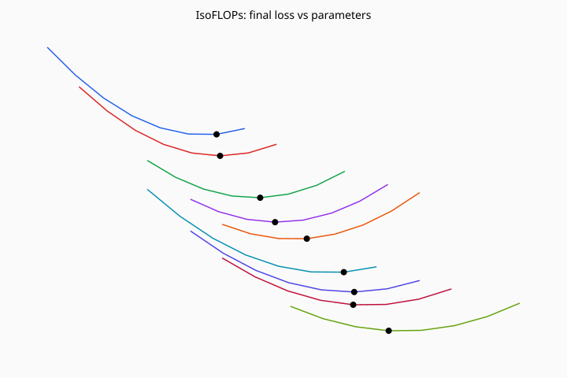

# Stanford CS336 — Language Modeling from Scratch

Self-study implementations of **[Stanford CS336](https://cs336.stanford.edu/)** (Spring 2026): build a language model from tokenizer through alignment, with staff tests as the quality bar.

This is **course work**, not a shipping product. Implementations live in this repo; large datasets, checkpoints, and GPU runs stay local.

**Author:** [Mangesh Raut](https://github.com/mangeshraut712) · **Not enrolled for credit** — no Gradescope or leaderboard submissions.

[Course](https://cs336.stanford.edu/) · [Lectures (2026)](https://github.com/stanford-cs336/lectures) · [Staff assignments](https://github.com/stanford-cs336) · [Layout](docs/LAYOUT.md) · [Purpose](docs/PURPOSE.md)

## What’s inside

Five standalone [`uv`](https://docs.astral.sh/uv/) projects under [`assignments/`](assignments/):

| # | Topic | In this repo | Tests (local) |
|---|-------|--------------|---------------|
| [1 — Basics](assignments/assignment1-basics/) | Byte-level BPE, GPT-style transformer, AdamW, TinyStories / OWT training | Val loss TS **2.07**, OWT **5.38** | 47 pass, 1 xfail |
| [2 — Systems](assignments/assignment2-systems/) | Flash attention, DDP, FSDP, sharded AdamW | CPU / gloo path on Mac | 10 pass, 4 skip |
| [3 — Scaling](assignments/assignment3-scaling/) | IsoFLOPs, Chinchilla-style fits | Predicted **L ≈ 7.17**; curves below | 7/7 + artifacts |
| [4 — Data](assignments/assignment4-data/) | Extract, LID, PII, classifiers, dedup | Required modules + tests | 21/21 |
| [5 — Alignment](assignments/assignment5-alignment/) | GRPO, SFT packing, DPO, eval parsers | Required modules + tests | 26/26 |

```bash
bash scripts/verify_all.sh
```

Each assignment is verified from its own directory (`uv run pytest -q` and/or `bash scripts/finalize_assignment.sh`). See [`docs/LAYOUT.md`](docs/LAYOUT.md).

## Assignment 3 artifact (tracked)

IsoFLOPs curves from the scaling-law assignment (SVG in git, not a product screenshot):



Related local files (open on disk; this repo does not use GitHub Pages):

- [Scaling experiments dashboard](assignments/assignment3-scaling/examples/dashboard.html) (`examples/dashboard.html`)
- [Training API client notebook](assignments/assignment3-scaling/examples/client_example.ipynb)

## Docs

| File | Role |
|------|------|
| [docs/PURPOSE.md](docs/PURPOSE.md) | Why this monorepo exists (self-study scope) |
| [docs/LAYOUT.md](docs/LAYOUT.md) | Folder layout, verify commands, local-only paths |
| [assignments/README.md](assignments/README.md) | Per-assignment index |
| Per-assignment `PROJECT_STATUS.md`, `SOLUTION.md`, `LEARNINGS.md`, `writeup.md` | Status, implementation notes, writeups |

Handouts (`*.pdf`) stay next to each assignment, as in the staff repos.

## What belongs on GitHub

| In git | Local only |
|--------|------------|
| Source, tests, scripts, small artifacts | Token `.bin` memmaps, checkpoints |
| Docs, scaling fits, run summaries | `local-shared-data/` (~2GB classifiers for A4) |
| A5 staff eval fixtures (~85MB) | `.venv/`, Gradescope zips |

## Scope (honest)

All **local unit tests** listed above pass. Not included: Gradescope submissions, Modal GPU training (A4 full WET pipeline, A5 GSM8K GRPO), CUDA/B200 leaderboard runs, or the Stanford-hosted Hyperturing API (enrolled students only). The A3 dashboard HTML is a local example, not a deployed app.

## License and citation

Original portfolio documentation in this repository is [MIT](LICENSE) (© 2026 Mangesh Raut). Staff assignment scaffolding under `assignments/` remains MIT **Copyright Stanford University** as in each assignment `LICENSE`. See [`CITATION.cff`](CITATION.cff) if you cite this portfolio.

## Course links

- [CS336 course page](https://cs336.stanford.edu/) — Spring 2026
- [Lectures](https://github.com/stanford-cs336/lectures) — current offering
- [Spring 2025 lectures](https://github.com/stanford-cs336/spring2025-lectures) — previous offering
- [Staff assignment org](https://github.com/stanford-cs336)
